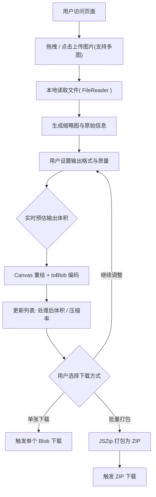

## 1. 产品概述

「PixelCraft」是一款纯前端运行、零后端依赖的在线图片处理工具，所有压缩与格式转换均在用户浏览器本地完成，从根本上杜绝图片隐私外泄。
- 解决用户在浏览器中快速完成图片压缩、格式转换与批量处理的需求，无需安装软件、无需上传到云服务器。
- 目标用户为内容创作者、设计师、自媒体运营者及对隐私敏感的普通用户；产品价值在于「极速 · 隐私 · 优雅」三者兼顾。

## 2. 核心功能

### 2.1 用户角色
本项目为单角色纯工具型应用，无需区分用户角色或权限。所有访客均可直接使用全部功能，无需注册登录。

### 2.2 功能模块
单页应用，所有功能集中在一个主页面内：
1. **主页面**：品牌顶栏、英雄引导区、拖拽上传区、处理控制面板、图片处理列表、批量操作栏、广告位区域、赞赏码区域、页脚。

### 2.3 页面详情

| 页面名称 | 模块名称 | 功能描述 |
|-----------|-------------|---------------------|
| 主页面 | 品牌顶栏 | 显示 Logo 与产品名「PixelCraft」，右侧为主要操作锚点与 GitHub 链接占位 |
| 主页面 | 英雄引导区 | 一句话标语 + 副标题，强调「本地处理 · 隐私优先 · 永久免费」，配合粒子/网格背景动画 |
| 主页面 | 拖拽上传区 | 支持点击选择与拖拽上传，支持多图同时上传；支持 JPG / PNG / WebP / BMP；拖拽悬停时高亮反馈 |
| 主页面 | 处理控制面板 | 输出格式选择（JPG / PNG / WebP）、压缩质量滑动条（0.1–1.0）、质量档位快捷按钮、实时预估输出体积展示、是否保留原文件名开关 |
| 主页面 | 图片处理列表 | 卡片式网格：缩略图预览、原文件名、原格式、原体积、处理后格式、处理后体积、压缩率徽标、单张下载按钮、单张删除按钮；支持「应用到全部」批量预设 |
| 主页面 | 批量操作栏 | 悬浮吸底工具条：已选数量、一键打包下载 ZIP、逐张下载（按序触发）、清空全部、全选/取消全选 |
| 主页面 | 广告位区域 | 显眼占位卡片，标注「广告位 Ad Slot」，预留 728×90 / 300×250 等常见尺寸，方便后续接入联盟广告 |
| 主页面 | 赞赏码区域 | 作者微信/支付宝赞赏码图片占位 + 「请作者喝杯咖啡」文案 + 二维码占位框 |
| 主页面 | 页脚 | 版权声明、技术声明（纯前端 Canvas API）、隐私承诺、友情链接占位 |

## 3. 核心流程

用户打开页面 → 拖拽或点击上传一张或多张图片 → 系统读取本地文件并生成缩略图列表 → 用户选择输出格式与压缩质量（滑动条实时回显预估体积）→ 系统对每张图片执行 Canvas 重绘与 `toBlob` 编码 → 列表实时更新处理后体积与压缩率 → 用户选择单张下载或一键打包 ZIP 下载 → 浏览器本地完成所有 IO，全程无网络请求。

## 4. 用户界面设计

### 4.1 设计风格
- **色彩**：以「近黑 #0A0A0B + 纯白 #FAFAFA」为基底，搭配单一高辨识强调色「电光青 #7CFFB2」与辅助冷紫「#A78BFA」；整体偏向 Vercel / Apple 的高级极简暗色调，并支持亮色切换。
- **毛玻璃**：导航栏、控制面板、悬浮工具条、卡片均使用 `backdrop-blur` + 半透明描边的 Glassmorphism 效果。
- **按钮**：圆角 12px、轻微内阴影 + 光晕悬停、主按钮渐变描边、次按钮 ghost 风格。
- **字体**：显示字体采用 `Space Grotesk` 风格的几何无衬线（实际使用 `Sora`），正文采用 `Manrope`，数字与代码采用 `JetBrains Mono`，标题大字号 + 紧字距。
- **布局**：桌面端单列居中最大宽度 1200px，关键区域使用 12 栅格；移动端单列堆叠，操作栏吸附底部。
- **动效**：卡片入场 staggered fade-up、滑动条 thumb 微光、拖拽区脉冲呼吸、背景渐变光斑缓慢漂移；所有过渡使用 `cubic-bezier(0.22, 1, 0.36, 1)` 缓动。
- **图标**：统一使用内联 SVG 线性图标（Lucide 风格），1.5px 描边。

### 4.2 页面设计概览

| 页面名称 | 模块名称 | UI 元素 |
|-----------|-----------|-------------|
| 主页面 | 品牌顶栏 | 毛玻璃吸顶、Logo + 名称、锚点导航、主题切换按钮 |
| 主页面 | 英雄引导区 | 超