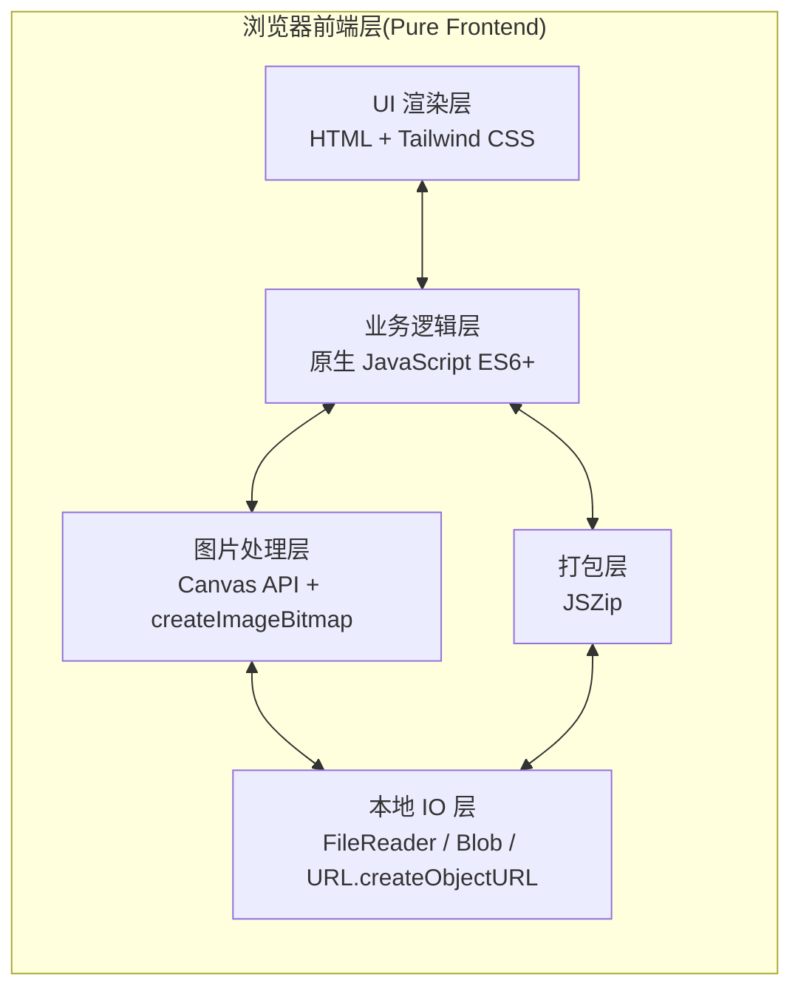
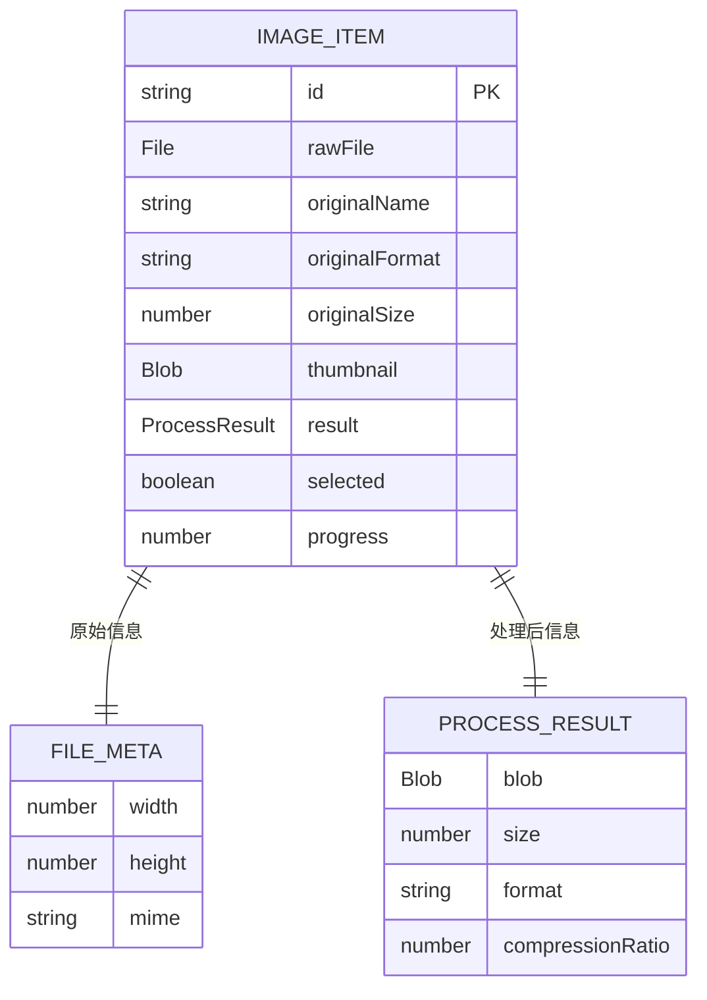

## 1. 架构设计

本项目为纯前端单页应用，零后端、零数据库、零网络请求（仅 CDN 资源加载）。所有图片处理逻辑运行在用户浏览器主线程与 Web Worker 中，确保隐私与性能。



## 2. 技术说明
- **前端**：原生 HTML5 + Tailwind CSS（Play CDN）+ 原生 JavaScript（ES6+ Modules），无框架依赖，单文件即可运行。
- **图片处理**：Canvas 2D API（`drawImage` + `toBlob`）作为主引擎；PNG 输出忽略质量参数，JPG/WebP 应用质量参数；BMP 解码后统一转为 ImageBitmap。
- **批量打包**：JSZip 3.x（CDN）生成 ZIP Blob，配合 `FileSaver` 思路用 `a[download]` 触发下载。
- **构建工具**：无需构建步骤，开发即生产；可选 Vite 用于本地预览。
- **依赖加载**：Tailwind / JSZip 通过 CDN `<script>` 引入，断网时核心功能仍可用（仅 ZIP 打包与样式降级）。
- **后端**：无。
- **数据库**：无；状态仅存于内存与 sessionStorage（可选记住上次格式/质量）。

## 3. 路由定义

| 路由 | 用途 |
|-------|---------|
| `/` （或 `index.html`） | 单一主页面，承载上传、处理、下载、广告位、赞赏码全部功能 |

无前端路由库；如需锚点跳转使用原生 `scrollIntoView`。

## 4. API 定义
本项目无后端，不涉及 HTTP API。内部以模块函数形式暴露能力：

```ts
// 假定类型（实际为 JS JSDoc 类型注释）
type Format = 'image/jpeg' | 'image/png' | 'image/webp';
type Quality = number; // 0.1 - 1.0

interface ProcessResult {
  blob: Blob;
  size: number;        // bytes
  width: number;
  height: number;
  format: Format;
  compressionRatio: number; // 1 - newSize/oldSize
}

async function processImage(file: File, format: Format, quality: Quality): Promise<ProcessResult>;
async function estimateSize(file: File, format: Format, quality: Quality): Promise<number>;
async function downloadOne(result: ProcessResult, name: string): Promise<void>;
async function downloadZip(results: ProcessResult[], names: string[]): Promise<void>;
```

## 5. 服务器架构图
不适用（纯前端，无服务器）。

## 6. 数据模型
### 6.1 数据模型定义
本项目无持久化数据库，运行时数据结构如下：



### 6.2 数据定义语言
不适用（无数据库表）。
